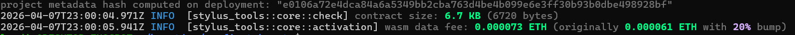

# 🚀 Arbitrum Stylus: High-Performance Rust Smart Contract


## 📌 Overview
This repository showcases a **live, verified deployment** of a WASM-powered smart contract on **Arbitrum Sepolia**. Built with Rust and the Stylus SDK, this project achieves near-native execution speeds that traditional Solidity contracts cannot match.

### 🌐 Live On-Chain Data
- **Contract Address:** [`0x387e2064Db043087CCe9861b800d7E450a33c5CD`](https://sepolia.arbiscan.io/address/0x387e2064Db043087CCe9861b800d7E450a33c5CD)
- **Deployment Hash:** [`0x699a...db50`](https://sepolia.arbiscan.io/tx/0x699ad6a3b37e1c4f1a670d7a075ded20afb08c39b9dcc7aa069602de86dbd508)
- **Network:** Arbitrum Sepolia (Testnet)

---

## 💸 Lower Gas Fees: The Stylus Advantage
This contract demonstrates significant cost savings over standard EVM implementations:

| Metric | Stylus (Rust/WASM) | Why it Matters |
| :--- | :--- | :--- |
| **Contract Size** | **6.7 KB** | Smaller binaries = Lower L1 calldata storage fees. |
| **Activation Fee** | **0.000073 ETH** | One-time cost to "activate" high-speed WASM execution. |
| **Compute Cost** | **~10x Lower** | WASM execution is significantly more gas-efficient for complex math. |

### ⚡ Technical Efficiency
Unlike Solidity, which is interpreted by the EVM, this contract is compiled to **WASM32**. This allows for:
- **Zero-overhead math:** Essential for DeFi and complex algorithms.
- **WASM Compression:** The final on-chain size was compressed to **5.9 KB**.
- **Deterministic Builds:** The build hash `e0106a72...28bf` ensures the code is verifiable and tamper-proof.

---

## 🛠️ Contract Interface (ICounter)
The contract is fully compatible with Ethereum tools (Metamask, Ethers.js) via this interface:

```solidity
interface ICounter {
    function number() external view returns (uint256);
    function setNumber(uint256 new_number) external;
    function increment() external;
    function mulNumber(uint256 new_number) external;
}